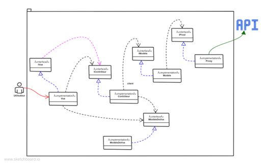
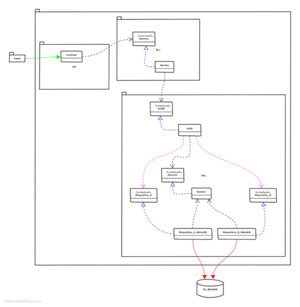
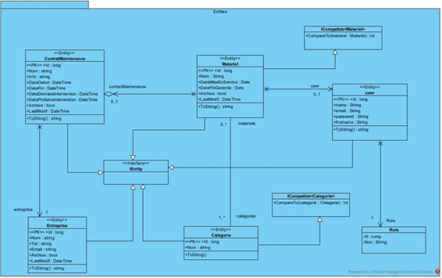
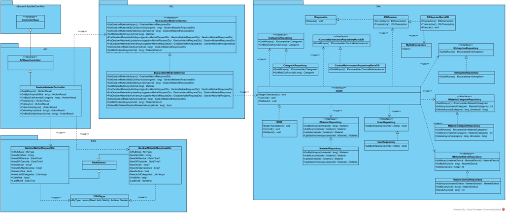
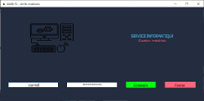
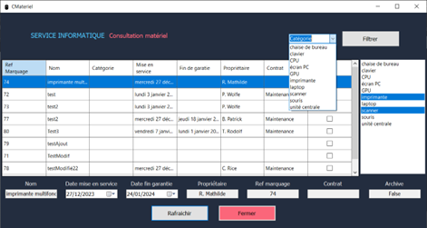
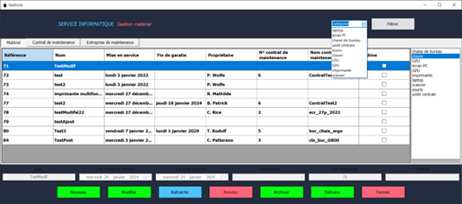

# Application Client-Serveur (Windows Forms API REST)

Projet de mise en situation professionnelle dans le cadre du RNCP 31678 de niveau 6 Concepteur Développeur d’application ESRP 2isa Millau

EPCF 2 - Projet fil-rouge jalon 2 | application client-serveur .NET 8

Résumé :

L'association AMIO m'a confié, la simplification la maintenance du parc matériel en améliorant la communication entre

les utilisateurs et le Service Informatique. Ce projet a abouti au développement de deux applications : une application

web, déjà validée au jalon un, et une application desktop exclusivement dédiée au SI, sur laquelle se focalise le présent

rapport, correspondant au deuxième jalon.

La requête de l'association distingue deux rôles au sein du Service Informatique : consultation et gestion, dans les

fonctionnalités de l'application. Le premier rôle permet de consulter les actifs et les filtrés suivant leurs catégories.

Tandis que le deuxième permet de gérer les entrées, sorties, modifications et archivages d'actifs, y compris ceux sous

contrat de maintenance avec des entreprises externes.

Dans les premières étapes, j'ai identifié les besoins du client, et j’ai déterminé les fonctionnalités par les cas

d'utilisation. En parallèle, j'ai conçu des maquettes inspirées de l'application GLPI actuelle, en utilisant l’application

web Figma, et rédigé des scripts SQL pour la création de la base de données, en vue d'un déploiement sur MariaDB.

Après la validation du Product Owner, j'ai développé le client-serveur en utilisant le Framework .Net, avec pour le

desktop, une interface Windows Forms, adoptant une architecture MVC. La conception en couches pour l'API REST est

respectée. L’injection de dépendances, a facilité la réalisation de contrats d'interfaces, rendant le système

maintenable et évolutif. Les tests, automatisés avec xUnit, ont couvert les aspects unitaires, et d'intégration. En finalité

j’ai déployé l’api en container avec un client en X64.

Fil-Rouge Phase 2 | Application web | 09 février 2024

Patrick Nardi | CDA07

https://patricknardi.com/

https://www.francecompetences.fr/recherche/rncp/31678/

 

  
